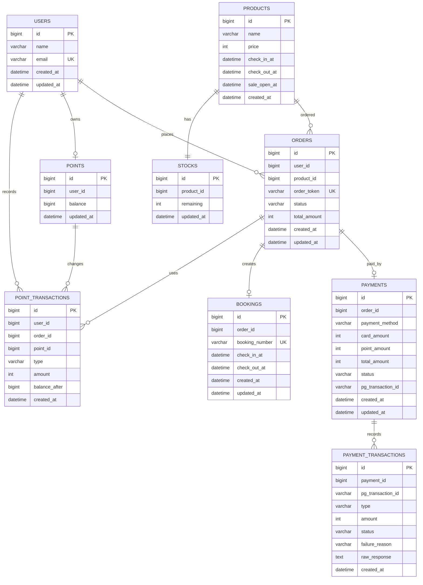

# ERD

주문/결제/예약 도메인을 중심으로 한 데이터 모델 \
JPA entity 기준이며, 외래키는 현재 코드에서 물리 FK로 강제하지 않고 `*_id` 값을 저장하는 방식 \
운영 환경에서는 조회 성능과 정합성 정책에 따라 FK와 index를 명시적으로 추가할 수 있음



## 테이블 역할

- `users`: 사용자 기본 정보. 인증/인가 범위는 제외하고 식별용으로만 사용
- `products`: 판매 상품 정보와 판매 오픈 시각, 입/퇴실 시각을 저장
- `stocks`: 상품별 최종 재고 원장입니다. Redis 선점 이후 성공 흐름에서 DB 재고를 확정 차감
- `orders`: 예약/결제 흐름의 상위 aggregate 역할, `order_token` unique constraint로 중복 주문을 방어
- `payments`: 주문별 결제 요약 상태
- `payment_transactions`: PG 승인/취소/실패 이력을 저장 (장애 분석과 수동 정산의 근거)
- `points`: 사용자별 포인트 잔액 원장
- `point_transactions`: 포인트 사용/환불 이력을 저장
- `bookings`: 확정된 최종 예약 정보와 booking 번호를 저장
  - 처리 중/성공/실패 상태는 `orders.status`가 담당하므로 별도 예약 상태는 두지 않음

## 주요 제약

- `users.email`: unique
- `orders.order_token`: unique
- `bookings.booking_number`: unique
- `payment_transactions.pg_transaction_id, type`: unique nullable

## DDL 예시

Hibernate `ddl-auto=update`로 실행 시 스키마가 생성되지만, 주문/결제 중심 DDL은 아래와 같이 해석할 수 있음

```sql
CREATE TABLE users (
  id BIGINT NOT NULL AUTO_INCREMENT,
  name VARCHAR(255) NOT NULL,
  email VARCHAR(255) NOT NULL,
  created_at DATETIME NOT NULL,
  updated_at DATETIME,
  PRIMARY KEY (id),
  UNIQUE KEY uk_users_email (email)
);

CREATE TABLE products (
  id BIGINT NOT NULL AUTO_INCREMENT,
  name VARCHAR(255) NOT NULL,
  price INT NOT NULL,
  check_in_at DATETIME NOT NULL,
  check_out_at DATETIME NOT NULL,
  sale_open_at DATETIME NOT NULL,
  created_at DATETIME NOT NULL,
  PRIMARY KEY (id)
);

CREATE TABLE stocks (
  id BIGINT NOT NULL AUTO_INCREMENT,
  product_id BIGINT NOT NULL,
  remaining INT NOT NULL,
  updated_at DATETIME NOT NULL,
  PRIMARY KEY (id),
  KEY idx_stocks_product_id (product_id)
);

CREATE TABLE orders (
  id BIGINT NOT NULL AUTO_INCREMENT,
  user_id BIGINT NOT NULL,
  product_id BIGINT NOT NULL,
  order_token VARCHAR(255) NOT NULL,
  status VARCHAR(50) NOT NULL,
  total_amount INT NOT NULL,
  created_at DATETIME NOT NULL,
  updated_at DATETIME,
  PRIMARY KEY (id),
  UNIQUE KEY uk_orders_order_token (order_token),
  KEY idx_orders_user_id (user_id),
  KEY idx_orders_product_id (product_id)
);

CREATE TABLE payments (
  id BIGINT NOT NULL AUTO_INCREMENT,
  order_id BIGINT NOT NULL,
  payment_method VARCHAR(50) NOT NULL,
  card_amount INT NOT NULL,
  point_amount INT NOT NULL,
  total_amount INT NOT NULL,
  status VARCHAR(50) NOT NULL,
  pg_transaction_id VARCHAR(255),
  created_at DATETIME NOT NULL,
  updated_at DATETIME,
  PRIMARY KEY (id),
  KEY idx_payments_order_id (order_id)
);

CREATE TABLE payment_transactions (
  id BIGINT NOT NULL AUTO_INCREMENT,
  payment_id BIGINT NOT NULL,
  pg_transaction_id VARCHAR(255),
  type VARCHAR(50) NOT NULL,
  amount INT NOT NULL,
  status VARCHAR(50) NOT NULL,
  failure_reason VARCHAR(255),
  raw_response TEXT,
  created_at DATETIME NOT NULL,
  PRIMARY KEY (id),
  UNIQUE KEY uk_payment_transactions_pg_transaction_id_type (pg_transaction_id, type),
  KEY idx_payment_transactions_payment_id (payment_id)
);

CREATE TABLE points (
  id BIGINT NOT NULL AUTO_INCREMENT,
  user_id BIGINT NOT NULL,
  balance BIGINT NOT NULL,
  updated_at DATETIME NOT NULL,
  PRIMARY KEY (id),
  KEY idx_points_user_id (user_id)
);

CREATE TABLE point_transactions (
  id BIGINT NOT NULL AUTO_INCREMENT,
  user_id BIGINT NOT NULL,
  order_id BIGINT,
  point_id BIGINT NOT NULL,
  type VARCHAR(50) NOT NULL,
  amount INT NOT NULL,
  balance_after BIGINT NOT NULL,
  created_at DATETIME NOT NULL,
  PRIMARY KEY (id),
  KEY idx_point_transactions_user_id (user_id),
  KEY idx_point_transactions_order_id (order_id),
  KEY idx_point_transactions_point_id (point_id)
);

CREATE TABLE bookings (
  id BIGINT NOT NULL AUTO_INCREMENT,
  order_id BIGINT NOT NULL,
  booking_number VARCHAR(255) NOT NULL,
  check_in_at DATETIME NOT NULL,
  check_out_at DATETIME NOT NULL,
  created_at DATETIME NOT NULL,
  updated_at DATETIME,
  PRIMARY KEY (id),
  UNIQUE KEY uk_bookings_booking_number (booking_number),
  KEY idx_bookings_order_id (order_id)
);

```
