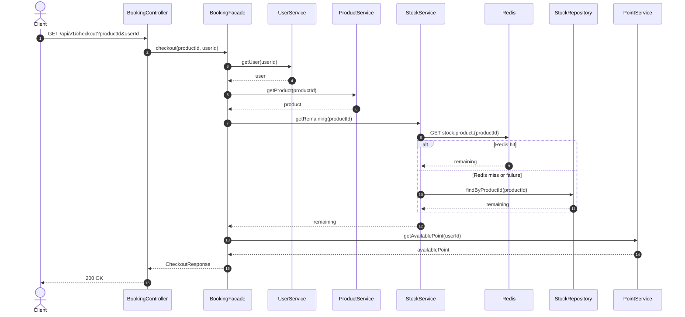
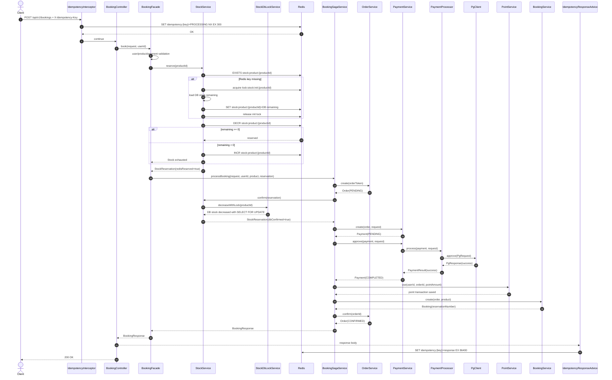
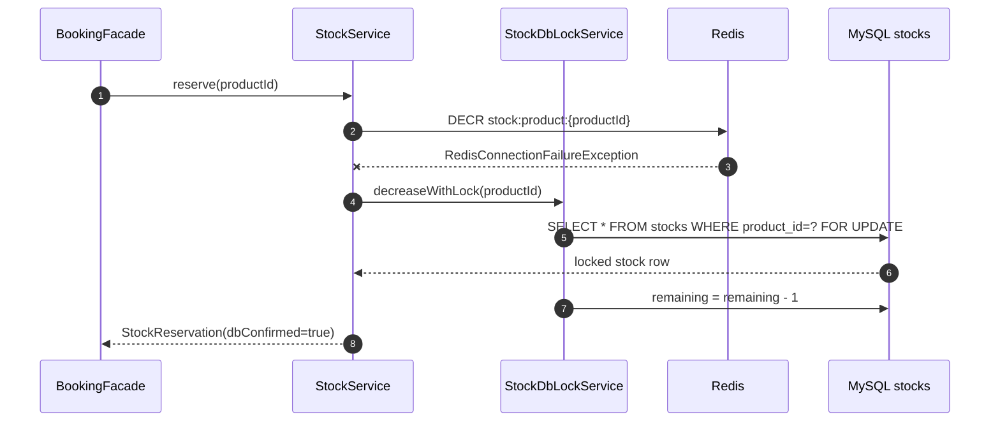
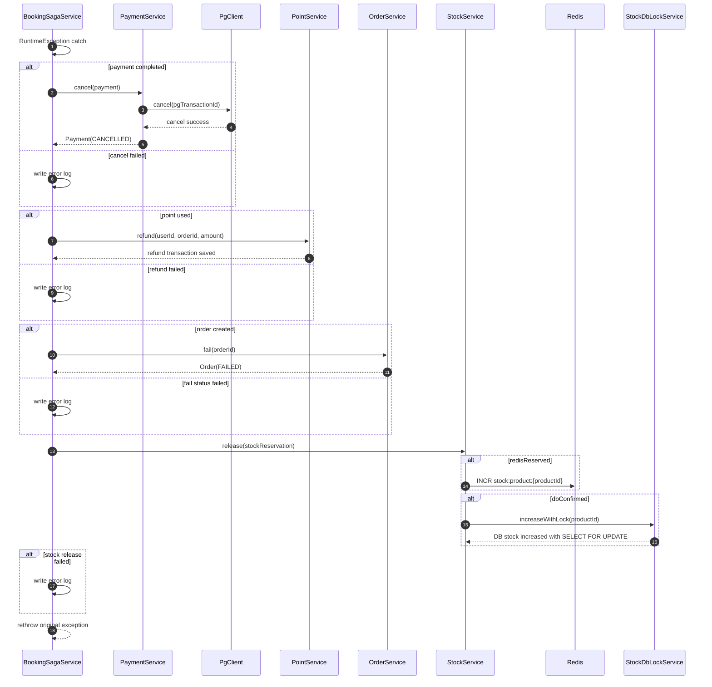
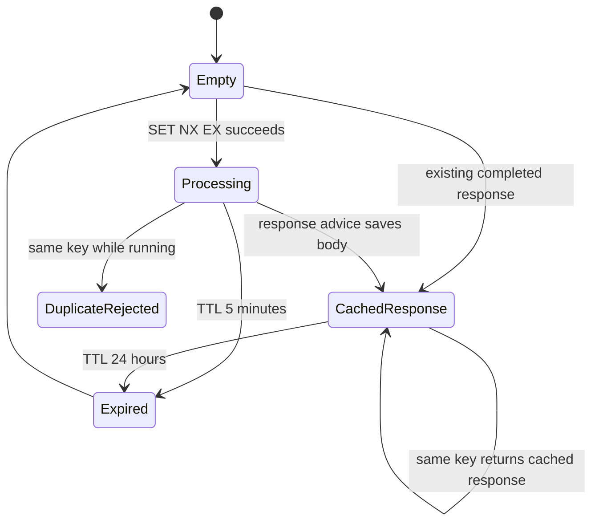
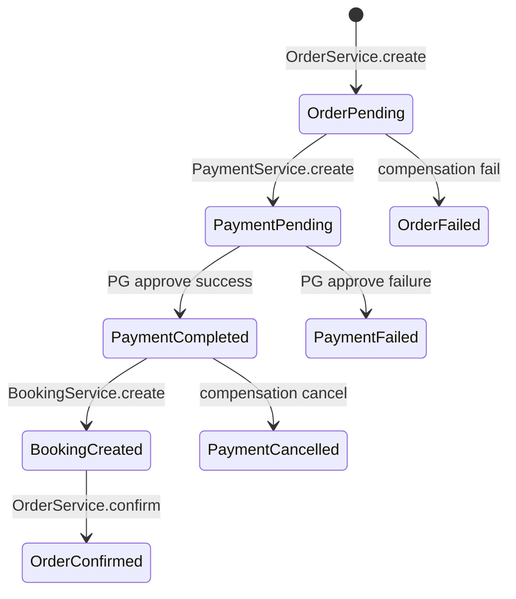

# Sequence Diagrams

## Checkout API

상품 정보, 현재 조회 가능한 재고, 가용 포인트를 반환 \
이 값은 화면 표시용 스냅샷, 최종 예약 가능 여부는 Booking API에서 다시 검증

## Booking API - Success

멱등성 검증, 재고 선점, 결제 승인, 포인트 차감, 예약 확정을 순서대로 처리 \
현재 구현은 오케스트레이션 Saga 방식

## Booking API - Redis Fallback

Redis 장애 시 재고 선점은 DB 비관적 락 경로로 전환됨

## Booking API - Failure Compensation

Saga 중간에 실패하면 이미 성공한 단계를 보상 \
보상은 가능한 한 독립 트랜잭션으로 커밋되어 원 실패와 분리됨

## Idempotency State

## Order/Payment State And Booking Creation

